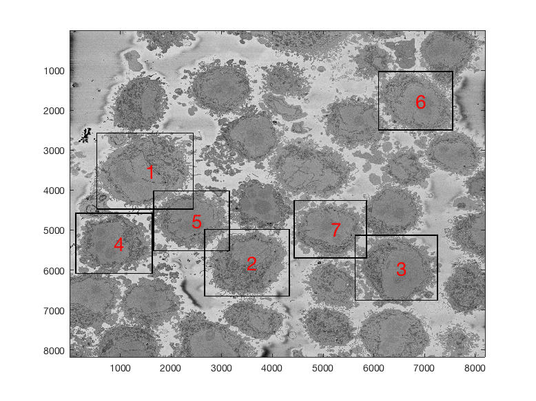
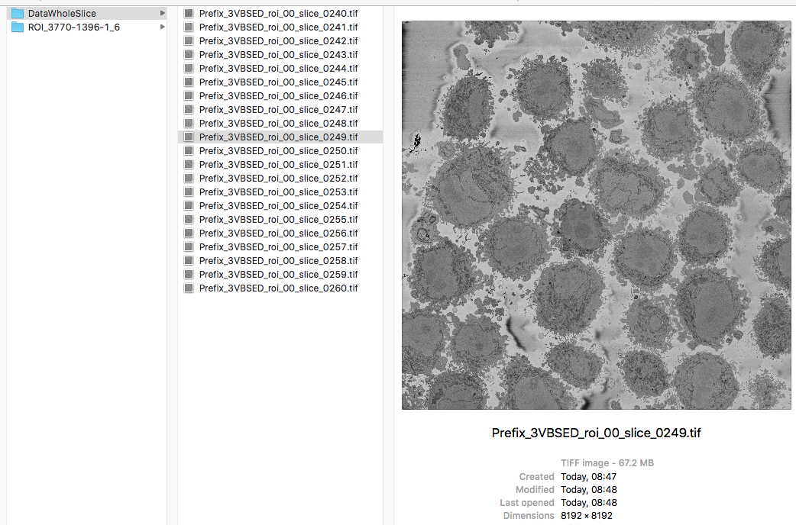
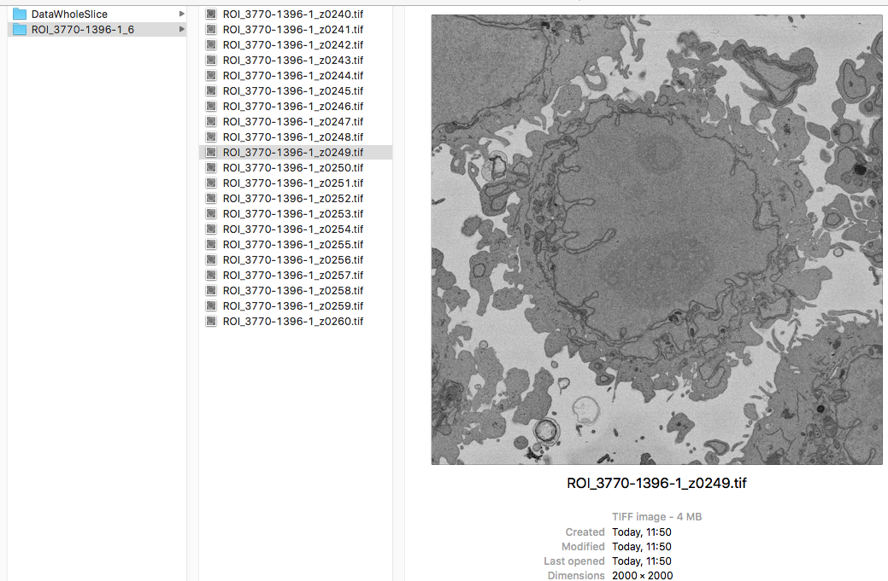
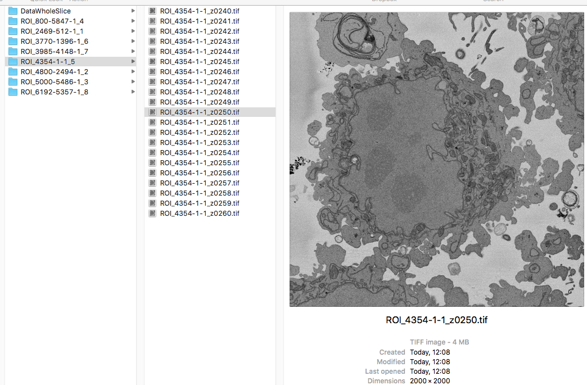

# HeLa-Cell-Segmentation
Segmentation, Measurement and Visualisatin of Nuclear Envelope of HeLa Cells observed with Electron Microscope

  

##### Table of Contents  

[HeLa Cells](#HeLa)  
[Citation](#citation)   
[Brief Description](#description)   
[Limitations](#limitations)   
[Running the code](#running)   
[Results](#results)   
[More input parameters](#parameters)   
[Region of Interest from 8000 x 8000 images](#ROIS)   
[Input Options](#InputOptions)
[Automatic cropping of multiple Regions of Interest](#multipleROIs)
[Visual validation of the output](#validation)  
[Automatic cropping of Regions of Interest](#cropping)  

<a name="HeLa"/>
<h2> Segmentation of Nuclear Envelope of HeLa Cells observed with Electron Microscope </h2>
</a>

This code contains an image-processing pipeline for the automatic segmentation of the nuclear envelope of {\it HeLa} cells 
observed through Electron Microscopy. This pipeline has been tested with a 3D stack of 300 images. 
The intermediate results of neighbouring slices are further combined to improve the final results. 
Comparison with a hand-segmented  ground truth reported Jaccard similarity values between 94-98% on 
the central slices with a decrease towards the edges of the cell where the structure was considerably more complex.
The processing is unsupervised and  each 2D Slice is processed in about 5-10 seconds running on a MacBook Pro. 
No systematic attempt to make the code faster was made.

<a name="citation"/>
<h2> Citation </h2>
</a>

This work has been published in the Journal of Imaging, if you find the work or the software interesting or useful, please cite as:    
<b>Cefa Karabag, Martin L. Jones, Christopher J. Peddie, Anne E. Weston, Lucy M. Collinson, and Constantino Carlos Reyes-Aldasoro,
Segmentatin and Modelling the nuclear envelope of HeLa cells, J Imaging (2019), 5(9), 75
https://doi.org/10.3390/jimaging5090075
</b>
   
A previous version was accepted as an oral presentation in the conference Medical Image Understanding and Analysis (MIUA) 2018 (https://miua2018.soton.ac.uk) 
 
 <b>Automated Segmentation of HeLa Nuclear Envelope from Electron Microscopy Images</b>,<i> in Proceedings of Medical Image Understanding and Analysis</i>, 9-11 July 2018, Southampton, UK.
 

<a name="description"/>
<h2> Brief description </h2>
</a>

The methodology consists of several image-processing steps: low-pass filtering, edge detection and determination of super-pixels, 
distance transforms and delineation of the nuclear envelope. 

<a name="limitations"/>
<h2>Limitations</h2>
</a>

The algorithm assumes the following: there is a single HeLa cell of interest, the  centre of the cell is located at centre 
of a 3D stack of images, 
the nuclear envelope is darker than the nuclei or its surroundings, the background is brighter than any cellular structure.

<a name="running"/>
<h2>Running the code</h2>
</a>

Assuming your image is a tiff file called 'Hela.tiff'

<pre class="codeinput">

Hela0 			= imread('Hela.tiff');
Hela 			= double(Hela0(:,:,1));   
Hela_background 	= segmentBackgroundHelaEM(Hela);
Hela_nuclei     	= segmentNucleiHelaEM(Hela);    

</pre>

<a name="results"/>
<h2>Results</h2>
</a>

The following animation shows a multi-slice segmentation where the segmented background is shaded in purple, 
the segmented nuclei is shaded in green, the ground truth is a red line.

<a name="parameters"/>
<h2>More input parameters</h2>
</a>

The code can receive 2 more parameters, one if you want to change the standard deviation of the Canny algorithm, and a previous segmentation. 

<pre class="codeinput">

nucleiHela = segmentNucleiHelaEM(Hela,previousSegmentation,cannyStdValue)

</pre>

This other parameter is useful when you are processing a large number of slices, you can segment the central slice and use that as a parameter for the slices above and below. When the shape becomes irregular, this allows the algorithm to select more than one region.

<a name="ROIS"/>
<h2>Region of Interest from 8000 x 8000 images</h2>
</a>

The above images have been manually cropped from a larger image by detecting the central point of the cells, and then selecting 300 slices and 2000 x 2000 pixels with the point as the centre. Whilst this is not too difficult, time consuming or error-prone, the detection of the background allows to detect automatically the majority of cells from one single plane.

Starting with one single 8000 x 8000 plane like this:

The background can be segmented as previously described to obtain this

Then, from this background, it is easy to calculate a distance transform:

That distance transform is related to the cells in the image in terms of their size, and how far away they are from the background. 

Thus, provided that there <b>is some background</b> in the plane (and that would be the main limitation of the algorithm), the cells can be detected by finding peaks on the distance, selecting a region of interest based on the height of that peak, and then proceeding to the following peak. It is important to proceed iteratively as the region of each cell may contain several "peaks", and each iteration removes all the peaks from that region.

The code runs like this
<pre class="codeinput">

IndividualHelaLabels       = detectNumberOfCells(Hela);

</pre>

The segmentation will produce automatically an image for validation purposes

<pre class="codeinput">
IndividualHelaLabels       = detectNumberOfCells(hela,7);
</pre>

The algorithm can stop in 2 ways, one is to request a specific number of cells, say you are only interested in the 10 largest cells (second argument to the function), or until no more cells are detected (only one argument is passed, the image itself). An assumption for this last condition is that cells will only be considered if their associated distance peaks are within a limit, currently 50% of the height of the top peak.

The output of the function is one 3D matrix with one level per cell detected. To visualise any given cell, you can just use one level of the 3D Matrix like this:

<pre class="codeinput">

imagesc(Hela.*(IndividualHelaLabels(:,:,1)))
imagesc(Hela.*(IndividualHelaLabels(:,:,2)))
</pre>

Further analysis can consider distance between cells, cells that are in contact with the edge of the image, size of the cells, etc.

<a name="InputOptions"/>
<h2>Input Options</h2>
</a>

There are three options to select the image to be segmented: 

(1) Read an image (with "imread") and pass the variable with the 2D matrix, 
(2) Pass the name of the image as an argument to the function, the function will read automatically that image,
(3) Pass the name of the folder where the image is located, the function will read the whole directory inside the folder, will select the middle slice and will read automatically.

<pre class="codeinput">
>> IndividualHelaLabels       = detectNumberOfCells(Hela,10);
>> IndividualHelaLabels       = detectNumberOfCells('DataWholeSlice/Prefix_3VBSED_roi_00_slice_0249.tif',10);
>> IndividualHelaLabels       = detectNumberOfCells('DataWholeSlice',10);
</pre>

<a name="validation"/>
<h2>Visual validation of the output</h2>
</a>

Another way to create the validation image previously shown is using the function "validateIndividualHelaROIs". 

<pre class="codeinput">
validateIndividualHelaROIs(Hela,IndividualHelaLabels);
</pre>
 
This generates a figure with the image (<i>Hela</i>), and overlaid the boundaries of all labels (provided in <i>IndividualHelaLabels</i>), with a number associated to each ROI. The number is important as this can be later used to crop the whole ROI (2,000 x 2,000 x 300) from the whole field of view.

In this case we have detected seven ROIs using the second argument like this:

<a name="cropping"/>
<h2>Automatic cropping of Regions of Interest</h2>
</a>

It is possible to crop automatically a Region of Interest (ROI) from the 8,000 x 8,000 stack with the following function:

<pre class="codeinput">
 segmentHelaROI(inputFolder,IndividualHelaLabels,numberOfLabel,inputSlice)
</pre>

This function reads a folder where a stack of 8,000 x 8,000 images with numerous HeLa cells are stored, selects ONE region of interest (determined by numberOfLabels) and produces a reduced version of the data by cropping the images to a region of 2,000 x 2,000 and selecting that region in N (ideally 300) slices.

The arguments to the function are:
 inputFolder         : location of the input stack
 IndividualHelaLabels: This is a 3D matrix with the labels identifying 
                       the cells, but only one 2D slice should be used
                       to select the cell itself (e.g. (:,:,3)), thus
                       next argument is necessary. These are provided
                       by detectNumberOfCells
 numberOfLabel       : the cell to be extracted
 inputSlice          : the slice of the input stack from which the
                       data will be extracted

There is no output, all will be saved in the outputFolder. The output folder will be name as follows:

<b>ROI_RowLocation-ColumnLocation-SliceLocation_numberOfLabel</b>

And the file will be the same, except that the number of label is not used.

Example, the data is stored in the Folder "DataWholeSlice", and the ROIs selected is 6 

<pre class="codeinput">
inputFolder = 'CrickDataWholeSlice';
segmentHelaROI(inputFolder,IndividualHelaLabels,6)
</pre>

<a name="multipleROIs"/>
<h2>Automatic cropping of <b>multiple</b> Regions of Interest</h2>
</a>

It is possible to segment multiple ROIs in one line of code. The argument numberOfLabel can be passed with a number of ROIs selected like this:

<pre class="codeinput">
segmentHelaROI(inputFolder,IndividualHelaLabels,[1 3 4])
</pre>

or if all the ROIS that were previously detected are to be segmented, then the argument may be passed as empty or not even passed:

<pre class="codeinput">
segmentHelaROI(inputFolder,IndividualHelaLabels,[ ])
segmentHelaROI(inputFolder,IndividualHelaLabels)
</pre>

These two lines will produce the same output. In these cases, the code will iterate over all the possible ROIs and will create a folder for each case. If a certain ROI had been previously segmented, the code will skip the segmentation and will warn with the following lines:

<pre class="codeinput">
------------------------------------------------
---- ROI :5  -----------------------------------
Output folder is NOT empty
Please use a different name or empty the folder
------------------------------------------------
</pre>

If it is not already segmented, then the lines will be like this:

<pre class="codeinput">
----------------------------
---- ROI :8  ---------------
Output folder does not exist
Folder will be created
----------------------------
</pre>

