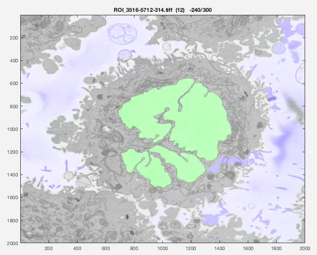
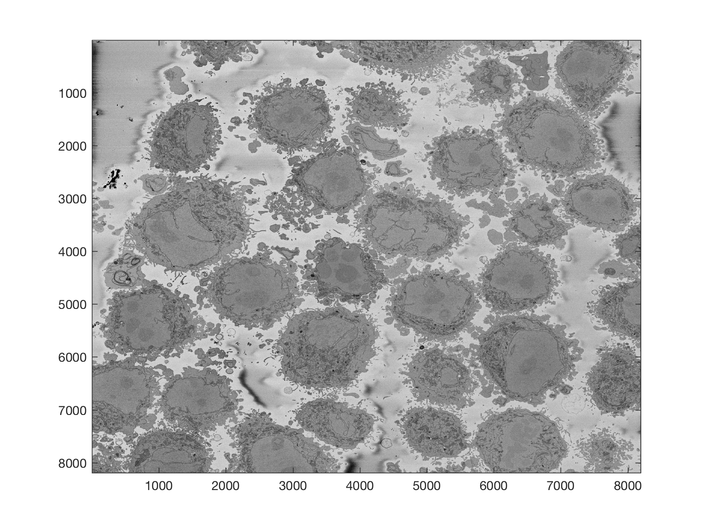
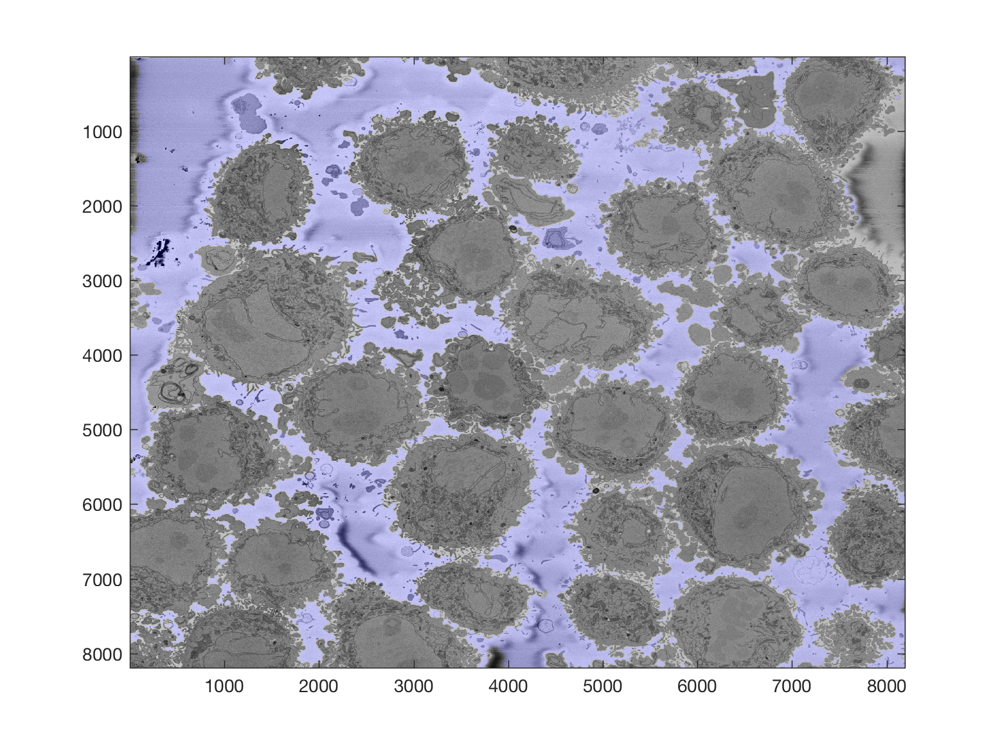
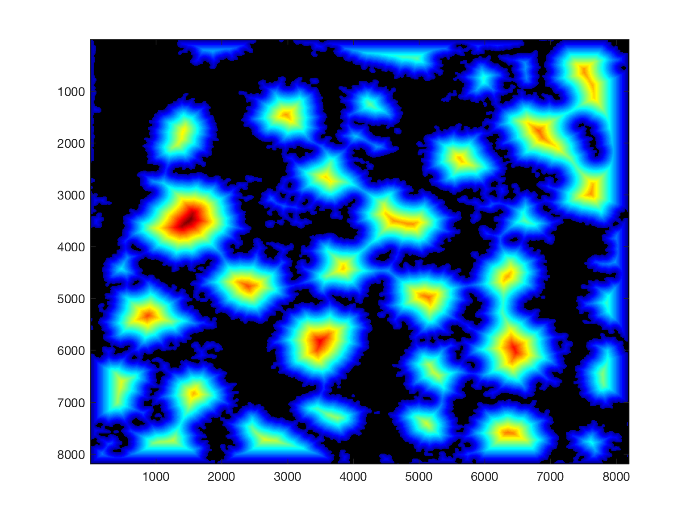
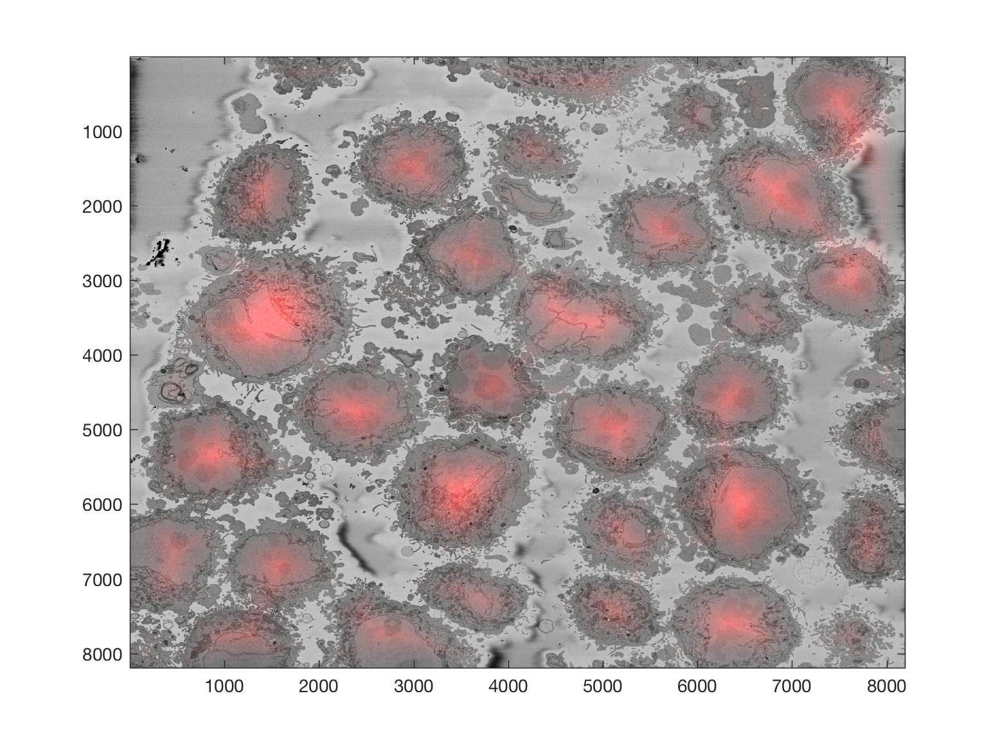
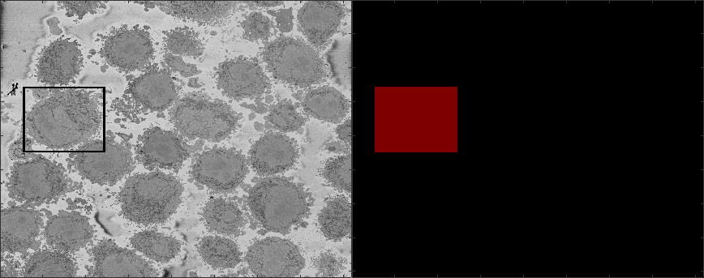
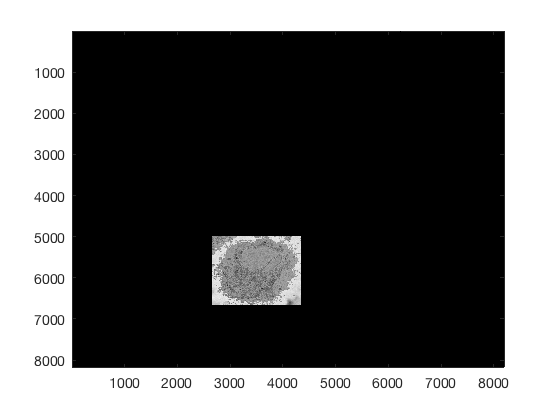

# HeLa-Cell-Segmentation
Segmentation of Nuclear Envelope of HeLa Cells observed with Electron Microscope

<h2>Segmentation of Nuclear Envelope of HeLa Cells observed with Electron Microscope</h2>

This code contains an image-processing pipeline for the automatic segmentation of the nuclear envelope of {\it HeLa} cells 
observed through Electron Microscopy. This pipeline has been tested with a 3D stack of 300 images. 
The intermediate results of neighbouring slices are further combined to improve the final results. 
Comparison with a hand-segmented  ground truth reported Jaccard similarity values between 94-98% on 
the central slices with a decrease towards the edges of the cell where the structure was considerably more complex.
The processing is unsupervised and  each 2D Slice is processed in about 5-10 seconds running on a MacBook Pro. 
No systematic attempt to make the code faster was made.

<h2> Citation </h2>
This work has been accepted as an oral presentation in the conference Medical Image Understanding and Analysis (MIUA) 2018 (https://miua2018.soton.ac.uk) please cite as:

 
Cefa Karabag, Martin L. Jones, Christopher J. Peddie, Anne E. Weston, Lucy M. Collinson, and Constantino Carlos Reyes-Aldasoro, <b>Automated Segmentation of HeLa Nuclear Envelope from Electron Microscopy Images</b>,<i> in Proceedings of Medical Image Understanding and Analysis</i>, 7-9 July 2018, Southampton, UK.
 

<h2> Brief description </h2>

The methodology consists of several image-processing steps: low-pass filtering, edge detection and determination of super-pixels, 
distance transforms and delineation of the nuclear envelope. 

<h2>Limitations</h2>

The algorithm assumes the following: there is a single HeLa cell of interest, the  centre of the cell is located at centre 
of a 3D stack of images, 
the nuclear envelope is darker than the nuclei or its surroundings, the background is brighter than any cellular structure.

<h2>Running the code</h2>

Assuming your image is a tiff file called 'Hela.tiff'

<pre class="codeinput">

Hela0 			= imread('Hela.tiff');
Hela 			= double(Hela0(:,:,1));   
Hela_background 	= segmentBackgroundHelaEM(Hela);
Hela_nuclei     	= segmentNucleiHelaEM(Hela);    

</pre>

<h2>Results</h2>

The following animation shows a multi-slice segmentation where the segmented background is shaded in purple, 
the segmented nuclei is shaded in green, the ground truth is a red line.

<h2>More input parameters</h2>

The code can receive 2 more parameters, one if you want to change the standard deviation of the Canny algorithm, and a previous segmentation. 

<pre class="codeinput">

nucleiHela = segmentNucleiHelaEM(Hela,cannyStdValue,previousSegmentation)

</pre>

This last parameter is useful when you are processing a large number of slices, you can segment the central slice and use that as a parameter for the slices above and below. When the shape becomes irregular, this allows the algorithm to select more than one region.

<h2>Region of Interest from 8000 x 8000 images</h2>

The above images have been manually cropped from a larger image by detecting the central point of the cells, and then selecting 300 slices and 2000 x 2000 pixels with the point as the centre. Whilst this is not too difficult, time consuming or error-prone, the detection of the background allows to detect automatically the majority of cells from one single plane.

Starting with one single 8000 x 8000 plane like this:

The background can be segmented as previously described to obtain this

Then, from this background, it is easy to calculate a distance transform:

That distance transform is related to the cells in the image in terms of their size, and how far away they are from the background. 

Thus, provided that there <b>is some background</b> in the plane (and that would be the main limitation of the algorithm), the cells can be detected by finding peaks on the distance, selecting a region of interest based on the height of that peak, and then proceeding to the following peak. It is important to proceed iteratively as the region of each cell may contain several "peaks", and each iteration removes all the peaks from that region.

The code runs like this
<pre class="codeinput">

IndividualHelaLabels       = detectNumberOfCells(Hela,10);

</pre>

The algorithm can stop in 2 ways, one is to request a specific number of cells, say you are only interested in the 10 largest cells (second argument to the function), or until no more cells are detected (only one argument is passed, the image itself). An assumption for this last condition is that cells will only be considered if their associated distance peaks are within a limit, currently 50% of the height of the top peak.

The output of the function is one 3D matrix with one level per cell detected. To visualise any given 

<pre class="codeinput">

imagesc(Hela.*(IndividualHelaLabels(:,:,1)))
imagesc(Hela.*(IndividualHelaLabels(:,:,2)))
</pre>

Further analysis can consider distance between cells, cells that are in contact with the edge of the image, size of the cells, etc.
