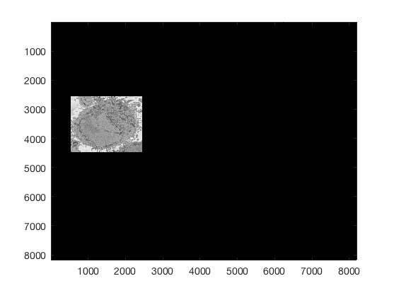
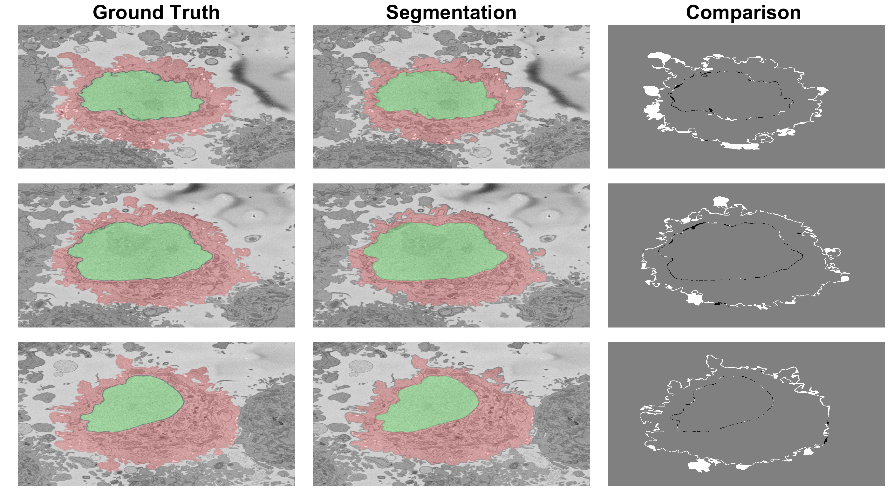

# HeLa-Cell-Segmentation
Segmentation, Measurement and Visualisation of Nuclear Envelope of HeLa Cells observed with Electron Microscope

  

##### Table of Contents  

[HeLa Cells](#HeLa)  
[Citation](#citation)   
[Data sets](#datasets)   
[Brief Description](#description)   
[Limitations](#limitations)   
[Running the code](#running)   
[Results](#results)   
[More input parameters](#parameters)   
[Region of Interest from 8000 x 8000 images](#ROIS)   
[Input Options](#InputOptions)
[Automatic cropping of multiple Regions of Interest](#multipleROIs)
[Visual validation of the output](#validation)  
[Automatic cropping of Regions of Interest](#cropping)  
[Processing an entire 8,000 x 8,000 x 518 volume data set](#entire8000set)  

<a name="HeLa"/>
<h2> Segmentation of Nuclear Envelope of HeLa Cells observed with Electron Microscope </h2>
</a>

This code contains an image-processing pipeline for the automatic segmentation of the nuclear envelope of <i> HeLa</i> cells
observed through Electron Microscopy. This pipeline has been tested with a 3D stack of 300 images.
The intermediate results of neighbouring slices are further combined to improve the final results.
Comparison with a hand-segmented  ground truth reported Jaccard similarity values between 94-98% on
the central slices with a decrease towards the edges of the cell where the structure was considerably more complex.
The processing is unsupervised and  each 2D Slice is processed in about 5-10 seconds running on a MacBook Pro.
No systematic attempt to make the code faster was made.

<a name="citation"/>
<h2> Citation </h2>
</a>

This work has been published in PLOS ONE (2020) and the Journal of Imaging (2021, 2019). If you find the work or the software interesting or useful, please cite as:   

<b>C Karabağ, ML Jones, CC Reyes-Aldasoro
Volumetric Semantic Instance Segmentation of the Plasma Membrane of HeLa Cells
 J. Imaging 2021, 7(6), 93; https://doi.org/10.3390/jimaging7060093
</b>
  

<b>C Karabağ, ML Jones, CJ Peddie, AE Weston, LM Collinson, CC Reyes-Aldasoro
Semantic segmentation of HeLa cells: An objective comparison between one traditional algorithm and four deep-learning architectures
PloS one 15 (10), e0230605
 https://doi.org/10.1371/journal.pone.0230605
</b>
  

<b>Cefa Karabag, Martin L. Jones, Christopher J. Peddie, Anne E. Weston, Lucy M. Collinson, and Constantino Carlos Reyes-Aldasoro,
Segmentation and Modelling the nuclear envelope of HeLa cells, J Imaging (2019), 5(9), 75
https://doi.org/10.3390/jimaging5090075
</b>
  
A previous version was accepted as an oral presentation in the conference Medical Image Understanding and Analysis (MIUA) 2018 (https://miua2018.soton.ac.uk)
 
 <b>Automated Segmentation of HeLa Nuclear Envelope from Electron Microscopy Images</b>,<i> in Proceedings of Medical Image Understanding and Analysis</i>, 9-11 July 2018, Southampton, UK.
 

<a name="datasets"/>
<h2> Data sets </h2>
</a>

All the data is available.
<ul>
<li> The 8000x8000 data sets are freely available through EMPIAR: http://dx.doi.org/10.6019/EMPIAR-10094
<li> The cropped images at 2000x2000 data sets are available through EMPIAR: https://dx.doi.org/10.6019/EMPIAR-10478
<li> The 4-class ground truth (nuclear envelope, nucleus, rest of the cell, and background) is available through Zenodo: https://doi.org/10.5281/zenodo.3874949
<li> The 5-class ground truth (1 nuclear envelope, 2 nucleus, 3 other cells, 4 background, 5 cell) is available through Zenodo: https://zenodo.org/record/4590903
</ul>
 

Data sets produced with this code are hosted in a parallel repository:
 

https://github.com/reyesaldasoro/Hela_Cell_Data
 

<a name="description"/>
<h2> Brief description </h2>
</a>
Semantic segmentation of (a) Nuclear envelope, and (b) cell from its neighbours as observed with Electron Microscopy in 3D. The methodology consists of several image-processing steps: low-pass filtering, edge detection and determination of super-pixels,
distance transforms and delineation of the nuclear and cell membranes.

<a name="limitations"/>
<h2>Limitations</h2>
</a>

The algorithm relies on a background that is brighter than the cells and their structures as can be seen in the figures of this page.

The algorithm to segment the nuclear envelope assumes the following: there is a single HeLa cell of interest, the  centre of the cell is located at centre
of a 3D stack of images, the nuclear envelope is darker than the nuclei or its surroundings, the background is brighter than any cellular structure.

The algorithm will segment regions of interest to ensure that there is a single HeLa cell of interest (there may be more surrounding the cell) in each cropped region..

<a name="running"/>
<h2>Running the code for a single 2,000 x 2,000 x 300 voxel region of interest with one cell</h2>
</a>

(If you want to start with the 8,000 x 8,000 x 518 voxel data set, skip to [Processing an entire 8,000 x 8,000 x 518 volume data set](#entire8000set)  )

Assuming your image is a tiff file called 'Hela.tiff' you can pass this directly to the function *segmentNucleiHelaEM* as an input argument and returns the segmentation of the nuclei with 1 and the rest with 0. The background is segmented with *segmentBackgroundHelaEM* and similarly returns a matrix with 1 for background and 0 for the rest.

<pre class="codeinput">

Hela0 			= imread('Hela.tiff');
Hela 			= double(Hela0(:,:,1));   
Hela_background 	= segmentBackgroundHelaEM(Hela);
Hela_nuclei     	= segmentNucleiHelaEM(Hela);    

</pre>

To process a stack of images, you can use the extension of the previous function through *segmentNucleiHelaEM_3D*. The input argument can be either:
1. a folder where the stack of images (these have to be *tiff* images, will analyse if there are other extension later on), one image per slice of the data,
2. a multidimensional TIFF file,
3. a three dimensional Matlab matrix.

The outputs of this function are 2 matrices *Hela_nuclei* and *Hela_background* which will be three dimensional with as many levels as slices of the original data.

**MEMORY:** these functions load all the slices into a single matrix in Matlab. This has been tested with 300 slices of 2,000 x 2,000 pixels on a computer with 32GB RAM memory. Computers with less memory may have problems. If you have less memory available, You can run a loop and segment per slice as described in one of the chapters. This was tested on a computer with 8GB RAM.

<a name="results"/>
<h2>Results</h2>
</a>

The following animation shows a multi-slice segmentation where the segmented background is shaded in purple,
the segmented nuclei is shaded in green, the ground truth is a red line.

<a name="parameters"/>
<h2>More input parameters</h2>
</a>

The code can receive 2 more parameters, one if you want to change the standard deviation of the Canny algorithm, and a previous segmentation.

<pre class="codeinput">

nucleiHela = segmentNucleiHelaEM(Hela,previousSegmentation,cannyStdValue)

</pre>

This other parameter is useful when you are processing a large number of slices, you can segment the central slice and use that as a parameter for the slices above and below. When the shape becomes irregular, this allows the algorithm to select more than one region.

<a name="ROIS"/>
<h2>Region of Interest from 8000 x 8000 images</h2>
</a>

The above images have been manually cropped from a larger image by detecting the central point of the cells, and then selecting 300 slices and 2000 x 2000 pixels with the point as the centre. Whilst this is not too difficult, time consuming or error-prone, the detection of the background allows to detect automatically the majority of cells from one single plane.

Starting with one single 8000 x 8000 plane like this:

The background can be segmented as previously described to obtain this

Then, from this background, it is easy to calculate a distance transform:

That distance transform is related to the cells in the image in terms of their size, and how far away they are from the background.

Thus, provided that there <b>is some background</b> in the plane (and that would be the main limitation of the algorithm), the cells can be detected by finding peaks on the distance, selecting a region of interest based on the height of that peak, and then proceeding to the following peak. It is important to proceed iteratively as the region of each cell may contain several "peaks", and each iteration removes all the peaks from that region.

The code runs like this
<pre class="codeinput">

IndividualHelaLabels       = detectNumberOfCells(Hela);

</pre>

The segmentation will produce automatically an image for validation purposes

<pre class="codeinput">
IndividualHelaLabels       = detectNumberOfCells(hela,7);
</pre>

The algorithm can stop in 2 ways, one is to request a specific number of cells, say you are only interested in the 10 largest cells (second argument to the function), or until no more cells are detected (only one argument is passed, the image itself). An assumption for this last condition is that cells will only be considered if their associated distance peaks are within a limit, currently 50% of the height of the top peak.

The output of the function is one 3D matrix with one level per cell detected. To visualise any given cell, you can just use one level of the 3D Matrix like this:

<pre class="codeinput">

imagesc(Hela.*(IndividualHelaLabels(:,:,1)))
imagesc(Hela.*(IndividualHelaLabels(:,:,2)))
</pre>

Further analysis can consider distance between cells, cells that are in contact with the edge of the image, size of the cells, etc.

<a name="InputOptions"/>
<h2>Input Options</h2>
</a>

There are three options to select the image to be segmented:

(1) Read an image (with "imread") and pass the variable with the 2D matrix,
(2) Pass the name of the image as an argument to the function, the function will read automatically that image,
(3) Pass the name of the folder where the image is located, the function will read the whole directory inside the folder, will select the middle slice and will read automatically.

<pre class="codeinput">
>> IndividualHelaLabels       = detectNumberOfCells(Hela,10);
>> IndividualHelaLabels       = detectNumberOfCells('DataWholeSlice/Prefix_3VBSED_roi_00_slice_0249.tif',10);
>> IndividualHelaLabels       = detectNumberOfCells('DataWholeSlice',10);
</pre>

<!---

<a name="validation"/>
<h2>Visual validation of the output</h2>
</a>

Another way to create the validation image previously shown is using the function "validateIndividualHelaROIs".

<pre class="codeinput">
validateIndividualHelaROIs(Hela,IndividualHelaLabels);
</pre>

This generates a figure with the image (<i>Hela</i>), and overlaid the boundaries of all labels (provided in <i>IndividualHelaLabels</i>), with a number associated to each ROI. The number is important as this can be later used to crop the whole ROI (2,000 x 2,000 x 300) from the whole field of view.

In this case we have detected seven ROIs using the second argument like this:

<a name="cropping"/>
<h2>Automatic cropping of Regions of Interest</h2>
</a>

It is possible to crop automatically a Region of Interest (ROI) from the 8,000 x 8,000 stack with the following function:

<pre class="codeinput">
 segmentHelaROI(inputFolder,IndividualHelaLabels,numberOfLabel,inputSlice)
</pre>

This function reads a folder where a stack of 8,000 x 8,000 images with numerous HeLa cells are stored, selects ONE region of interest (determined by numberOfLabels) and produces a reduced version of the data by cropping the images to a region of 2,000 x 2,000 and selecting that region in N (ideally 300) slices.

The arguments to the function are:
 inputFolder         : location of the input stack
 IndividualHelaLabels: This is a 3D matrix with the labels identifying
                       the cells, but only one 2D slice should be used
                       to select the cell itself (e.g. (:,:,3)), thus
                       next argument is necessary. These are provided
                       by detectNumberOfCells
 numberOfLabel       : the cell to be extracted
 inputSlice          : the slice of the input stack from which the
                       data will be extracted

There is no output, all will be saved in the outputFolder. The output folder will be name as follows:

<b>ROI_RowLocation-ColumnLocation-SliceLocation_numberOfLabel</b>

And the file will be the same, except that the number of label is not used.

Example, the data is stored in the Folder "DataWholeSlice", and the ROIs selected is 6

<pre class="codeinput">
inputFolder = 'CrickDataWholeSlice';
segmentHelaROI(inputFolder,IndividualHelaLabels,6)
</pre>

<a name="multipleROIs"/>
<h2>Automatic cropping of <b>multiple</b> Regions of Interest</h2>
</a>

It is possible to segment multiple ROIs in one line of code. The argument numberOfLabel can be passed with a number of ROIs selected like this:

<pre class="codeinput">
segmentHelaROI(inputFolder,IndividualHelaLabels,[1 3 4])
</pre>

or if all the ROIS that were previously detected are to be segmented, then the argument may be passed as empty or not even passed:

<pre class="codeinput">
segmentHelaROI(inputFolder,IndividualHelaLabels,[ ])
segmentHelaROI(inputFolder,IndividualHelaLabels)
</pre>

These two lines will produce the same output. In these cases, the code will iterate over all the possible ROIs and will create a folder for each case. If a certain ROI had been previously segmented, the code will skip the segmentation and will warn with the following lines:

<pre class="codeinput">
------------------------------------------------
---- ROI :5  -----------------------------------
Output folder is NOT empty
Please use a different name or empty the folder
------------------------------------------------
</pre>

If it is not already segmented, then the lines will be like this:

<pre class="codeinput">
----------------------------
---- ROI :8  ---------------
Output folder does not exist
Folder will be created
----------------------------
</pre>

--->

[//]: # (------------------------------------------------------------------------- 8000 here below ------------------------------------------------------------)

<a name="entire8000set"/>
<h2> Processing an entire 8,000 x 8,000 x 518 volume data set </h2>
</a>

The number of cells to be identified can be pre-defined per slice and then the process is repeated for a number of slices of the 3D stack. This is processed like this

<pre class="codeinput">
[final_coords,final_centroid,final_cells,final_dist]        = detectNumberOfCells_3D(baseDir,20,1);
</pre>

**baseDir** is a link to the folder that contains the 518 images, e.g.

<pre class="codeinput">
baseDir                         = 'C:\Users\sbbk034\Documents\Acad\Crick\Hela8000_tiff\';
</pre>

The selected number of cells to be detected *per slice* in this case is **20** and the final **1** is used to display the output. As the slices are processed, each with 20 cells, which are not always the same in each slice, there will be more cells detected. In this case, the algorithm has detected a total of 30 cells.

 The function returns

<pre class="codeinput">
>> whos
  Name                 Size            Bytes  Class     Attributes

  baseDir              1x52              104  char                
  final_cells         30x26             6240  double              
  final_centroid      30x5              1200  double              
  final_coords        30x6              1440  double              
  final_dist          30x26             6240  double              

>>
</pre>

Important among these ones are:
* the **centroids** of each cell, [row, column, z-stack position, base, top] e.g.

<pre class="codeinput">
 1280	4303	121	1	221
5825	2002	101	1	181
7312	3770	121	21	221
...
</pre>

* the **coordinates**  to be cropped of each cell, [init row, fin row,  init column fin column, init z fin z] e.g.

<pre class="codeinput">
1	2000	665	2664	1	300
5005	7004	3739	5738	1	300
280	2279	3303	5302	1	300
...
</pre>

The centroids of the cells are linked vertically to identify which centroids correspond to the same cell. The figure below illustrates the centroids at every 20 slices (i.e. 26 slices were analysed)

The next step is to crop these cells into their own individual regions of interest so that the become a single instance of a cell.  This is done with the command generate_ROI_Hela, which is used in the following way:

<pre class="codeinput">
listFolders         = generate_ROI_Hela (baseDir,final_coords,final_centroid);
</pre>

The output is one folder with 300 slices each 2,000 x 2,000 pixels wide.

There is a decision to process all the ROIs, there may be cells that are close to the top or bottom and thus would have only part of a cell, and similarly, the centroids may have been close to the edge of the volume.  It is possible to visualise these cells by displaying each volume. It is more practical to remove a corner to see how well located is each cell:

It can be seen that there are some cells that are either low and part of the cells is not within the field of view (1,2) and some others that are rather high (29,30) and part of the cell is again outside the field of view.  In addition, there are others that, due to their proximity to the edges of the volume are not centred but rather to a side (6,14). Observing the variable **final_centroid** is possible to determine how far away (i.e. absolute distance) are the centroids from the edges. If we use a margin of 500 pixels, we can observe that the centroids of following cells are less that the margin away in at least one dimension:

<pre class="codeinput">
6	0	417	0
14	489	746	0
15	0	432	0
27	455	489	0
28	588	465	97
</pre>

There are several complications if the cell is not well centred: (a) there may be several cells and it may be that two cells could be equally valid as an instance of the cell and (b) the algorithm assumes that the cell is centred for the selection of regions.

In addition, with respect to the top and bottom edges the following volumes are close to the edges:
<pre class="codeinput">
1	0	0	81
2	0	0	81
28	588	465	97
29	0	0	97
30	0	0	77
</pre>

The situation of cells that are close to the top and bottom are slightly different, here the problem is that the segmentation will not be of a complete cell but only part of it, so the segmentation may appear as a *hat* when it is in the lower section of the volume or a *bowl* if it is in the upper section. If metrics like volume are to be obtained, then these partial sections are not to be used. However, if what is of interest is an observation, rather than a quantification, then it is not a problem.

The segmentation of the cells and nuclei is shown below for 25 of the 30 cells. Cells 6, 14, 15, 27, 28 were not further processed. The cells are placed in the same location as the ROIs above to help visualisation.

The segmentation of the nuclear envelope follows these steps: (a) low-pass filtering, (b) Edges detection, the edges were further dilated
to connect those edges that may belong to the nuclear envelope (NE) but were disjoint due to the
variations of the intensity of the envelope itself. (c) Superpixels were generated by removing dilated
edges. (d) Small superpixels and those in contact with the image boundary were discarded and the
remaining superpixels were smoothed and filled, before discarding those by size that did not belong
to the nucleus. (e) Final segmentation of the NE overlaid (thick black line) on the filtered image. (f)
Ground truth (GT) manual segmentation of the same image. Regions not selected by the algorithm
because of their sizes are highlighted with arrows. Notice that both the algorithm and GT detected
disjoint regions.

The segmentation of one cell from its neighbours follows these steps: distance transformation from the background which grows around regions with cells and since there will be one larger *hill* at the centre. The distance transformation is then  segmented with a watershed algorithm. The central region is morphologically *opened* with large structural elements to remove protruding artefactual regions. This provides a fairly round cell that does not include the natural protrusions. Thus, regions that are contiguous to this central region and surrounded by background are identified and merged with the cell.

To process a 3D stack the commands are the following:

<pre class="codeinput">
[Hela_nuclei,Hela_background]  = segmentNucleiHelaEM_3D(listFolders{k});
[Hela_cell]                    = segmentCellHelaEM_3D(Hela_nuclei,Hela_background,[]);
</pre>

When the cells are not vertically centred as those previously mentioned, it is possible to add an optional parameter given by the previously calculated centroid:

<pre class="codeinput">
[Hela_nuclei,Hela_background]  = segmentNucleiHelaEM_3D(listFolders{k},(final_centroid(30,3)-final_coords(30,5)));
[Hela_cell]                    = segmentCellHelaEM_3D(Hela_nuclei,Hela_background,[],(final_centroid(30,3)-final_coords(30,5)));
</pre>

The second and fourth parameters (final_centroid(30,3)-final_coords(30,5)) indicate that the cell is not vertically centred and should be processed from that location.

The results are quite good when the cell is surrounded by background and cautious when there are cells close to each other. The figure below shows  a comparison  between  ground  truth  and  segmentation. Left column  shows GT (green for nucleus) and cell (red). Centre column shows segmentation. Right shows comparison between GT and the results with FP in white, FN in black and both TP and TN in gray.

Four  examples  of  volumetric  reconstruction  of  the  nuclear  envelope  and  the  cellmembrane of HeLa cells. In all cases, each row corresponds to a single cell observed from different view points. Left and centre columns show the cell membrane with transparency. Right column the cell membrane without transparency from the same view point as centre column.

Illustration of segmentation of 23 cells and nuclear envelopes. The cells were segmentedfrom a 8192×8192×518 voxel region.  Slice number 100 out of 518 is displayed for context.  Nuclei are solid and cell membranes are transparent. Colours have been assigned randomly for visualisation purposes.

Illustration of the nuclei only.

