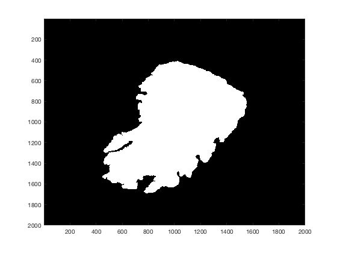
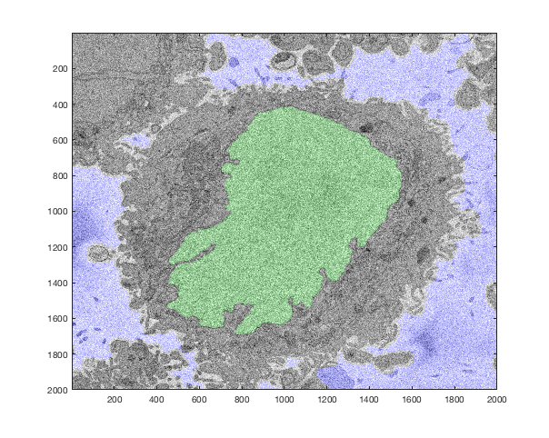

Contents
--------

<div>

-   [Modelling the nuclear envelope of HeLa cells](#1)
-   [Reference](#2)
-   [Nuclear envelope shape modelling. ](#4)
-   [Multiple slices](#10)
-   [Interpolate between slices](#11)
-   [Display of the 3D segmentation](#12)

</div>


<a name="1"/>
</a>

Modelling the nuclear envelope of HeLa cells
-------------------------------

This script follows from the framework for the automatic segmentation of the
nuclear envelope of cancerous HeLa cells. In here, the surface of the nuclear envelope is modelled against  an  ellipsoid.  The modelling of the surface provides a visual
display of the variations, both smooth and rugged over the surface, and
measurements can be extracted with the expectation that they can
correlate with the biological characteristics of the cells.

<p>

---------------------- WARNING -----------------------------------------

Modelling the surface is done in 3D and it requires a large amount of
memory. This was tested on a MAC with 32 GB RAM and a PC with 8 GB RAM.
The PC required the conversion of doubles to singles to cope with the
large variables. On the MAC there were no problems. Computers with less
than 8 GB may not be able to run this script as it is and will require
some trick to reduce the sizes, i.e. subsampling of the data.

---------------------- WARNING -----------------------------------------

</p>

<a name="2"/>
</a>

Reference
-------------------------------

For a detailed description please consult:
Modelling the nuclear envelope of HeLa cells

Cefa Karabağ, Martin L Jones, Christopher J Peddie, Anne E Weston, Lucy M Collinson, Constantino Carlos Reyes-Aldasoro

doi: https://doi.org/10.1101/344986


Load previous results  
-------------------------------

It is assumed that the results of the segmentation of the nuclear
envelope is Detect centroid of the cell, first calculate the volume of
the cell and its limits up and down that will be called North and South
Poles as a geographic analogy.

``` {.codeinput}
load('nucleiHelaC_2018_02_01.mat')
[rows,cols,levs]= size(Hela_nuclei3);
clear Hela_background_3
```

The background is not needed so it is removed to free memory.
Detect centroid of the cell, first calculate the volume of
the cell and its limits up and down that will be called North and South
Poles as a geographic analogy.


``` {.codeinput}
massCell            = squeeze(sum(sum(Hela_nuclei3)));
totalVolume         = sum(massCell);
southPole           = find(massCell,1,'first');
northPole           = 15+find(massCell,1,'last');
```


Calculate the centroid of the cell based on the projections on all dimensions


``` {.codeoutput}
cell_xy             = sum(Hela_nuclei3,3);
cell_xz             = squeeze(sum(Hela_nuclei3,1))';
cell_yz             = squeeze(sum(Hela_nuclei3,2))';

cell_xyP             = regionprops(cell_xy>0,'Centroid');
cell_yzP             = regionprops(cell_yz>0,'Centroid');
cell_xzP             = regionprops(cell_xz>0,'Centroid');

centroid_Cell       = [ cell_xyP.Centroid(1) + cell_xzP.Centroid(1) ...
    cell_xyP.Centroid(2) + cell_yzP.Centroid(1) ...
    cell_xzP.Centroid(2) + cell_yzP.Centroid(2)]/2;
```

Equivalent sphere
-------------------------------

We can use (20/number of slices) as parallels to display the model against which
the cell will be compared, it can be a sphere or an ellipse. Use
northpole - southpole to generate a mesh to extract the surface of the
cell

``` {.codeoutput}

%numParallels = 20;
numParallels = northPole-southPole;
```

A general sphere of radius 1 centred at the origin

``` {.codeoutput}
[x_Sph0,y_Sph0,z_Sph0]  = sphere(numParallels);
```

The equivalent radius is a single value that will multiply all points
equally

``` {.codeoutput}
equivRadius             = (totalVolume*3/4/pi).^(1/3);

x_Sph                   = x_Sph0*equivRadius + centroid_Cell(1);
y_Sph                   = y_Sph0*equivRadius + centroid_Cell(2);
z_Sph                   = z_Sph0*equivRadius + centroid_Cell(3);
```

<a name="4"/>
</a>

Nuclear envelope shape modelling.
-------------------------------

To further study the shape of the segmented NE, this was modelled against
a 3D ellipsoid. The ellipsoid was adjusted to have the same volume as the
nucleus. The equivalent radius is a vector that will multiply each z
level equally but the levels are not spherical


``` {.codeinput}
height                  = ( northPole-southPole )/2;
equivRadiusC            = (totalVolume*3/4/pi/height).^(1/2);

heightVec               = linspace(-height,height,numParallels+1);
radiusVec               = ( equivRadiusC*equivRadiusC* (1 - (heightVec.^2)/(height^2))  ).^(1/2);
radiusMat               = repmat(radiusVec',[1 numParallels+1]);
zDisplacement           = linspace(southPole,northPole,numParallels+1);

% Equivalent Ellipsoid
x_Ellip                 = x_Sph0.*radiusMat + centroid_Cell(1);
y_Ellip                 = y_Sph0.*radiusMat + centroid_Cell(2);
z_Ellip                 = z_Sph0*height + centroid_Cell(3);
```


Generate the reference framework to create a isosurface with fewer faces
--------------------------------------


``` {.codeinput}

[x2d,y2d]               = (meshgrid(1:cols,1:rows));
z2d                     = int16(ones(rows,cols));
x2d = int16(x2d);
y2d = int16(y2d);
```

% When the memory is limited, subsample for the 3D case
``` {.codeinput}
SubStep = 1;
x3d                     = repmat(x2d(1:SubStep:end,1:SubStep:end),[1 1 levs]);
y3d                     = repmat(y2d(1:SubStep:end,1:SubStep:end),[1 1 levs]);
%%
z3d(rows/SubStep,cols/SubStep,levs)     = int16(0);
for counterSlice=1:levs
    disp(counterSlice)
    z3d(:,:,counterSlice) = counterSlice*z2d(1:SubStep:end,1:SubStep:end);
end

z3d = int16(z3d);
```


Generate the isosurface of the cell
--------------------------------------

This generates an isosurface that has been subsampled for computational
efficiency. With a step of 16 there are visible artifacts


``` {.codeinput}
fstep= 8;
surf_Hela2          = isosurface(single(x3d(1:fstep:end,1:fstep:end,1:244)),...
    single(y3d(1:fstep:end,1:fstep:end,1:244)),...
    single(z3d(1:fstep:end,1:fstep:end,1:244)),...
    Hela_nuclei3(1:fstep:end,1:fstep:end,1:244),0.5);
```


Start the display with the cell surface
--------------------------------------


``` {.codeinput}

figure

handleSurfaceNuclearEnvelope =  patch(surf_Hela2);

lighting phong
camlight left
camlight right
set(handleSurfaceNuclearEnvelope,'facecolor','red')
set(handleSurfaceNuclearEnvelope,'edgecolor','none')

handleSurfaceNuclearEnvelope.FaceAlpha = 0.75;
```


Ellipsoid or Sphere meshes
--------------------------------------


Spheres do not adjust well to some cells that tend to be flatter. If you want to compare against a sphere, uncomment the following lines:

``` {.codeinput}
% hold on
% h_Sph                   = mesh(x_Sph,y_Sph,z_Sph);
% h_Sph.FaceColor='none';
% h_Sph.LineWidth=2;
```


We can now generate an ellipse and compare against the cell:
``` {.codeinput}
hold on
handle_Ellipsoid                    = mesh(x_Ellip,y_Ellip,z_Ellip);

handle_Ellipsoid.EdgeColor          = 'none';
handle_Ellipsoid.FaceColor          = 'b';
handle_Ellipsoid.LineWidth          = 2;
handle_Ellipsoid.FaceAlpha          = 0.75;
axis tight; grid on
```

The figure below shows the case where only 20 parallels were used to generate the sphere:


The figure below shows the case where the same number of slices and parallels was used:


Distance from Ellipsoid
--------------------------------------


The  surfaces  of  the  ellipsoid  and  the  nucleus  were  subsequently
compared  by tracing rays from the centre of the ellipsoid and the
distance between the surfaces for each ray was calculated. It was assumed
that when the nucleus surface was  further  away  from  the  centre,  the
difference  was  positive.

``` {.codeinput}
heightVec2              = linspace(-height,height,round(2*height)+1);
radiusVec2               = ( equivRadiusC*equivRadiusC* (1 - (heightVec2.^2)/(height^2))  ).^(1/2);


eqEllip(rows,cols,levs) =single(0);
circRef             = ( (single(x2d -centroid_Cell(1))).^2 + (single(y2d - centroid_Cell(2))).^2).^(0.5);

for counterSlice=southPole:northPole
    % Iterate over all slices
    disp(counterSlice)
    eqEllip(:,:,counterSlice)   = single(circRef<radiusVec2(counterSlice-southPole+1));   
end
% Convert to a single to save memory
eqEllip=single(eqEllip);
```


Display of the ellipsoid against the cell per slice
``` {.codeinput}
clear F
figure
h0=gcf;
for counterSlice=southPole:min(levs,northPole)
    disp(counterSlice)
    imagesc(2*Hela_nuclei3(:,:,counterSlice)+eqEllip(:,:,counterSlice));    
    title(strcat('Slice: ',num2str(counterSlice),', Jaccard:',num2str(sum(sum(Hela_nuclei3(:,:,counterSlice).*eqEllip(:,:,counterSlice)))/sum(sum(Hela_nuclei3(:,:,counterSlice)|eqEllip(:,:,counterSlice))))))
    drawnow
    pause(0.01)
    F(counterSlice-southPole+1) = getframe(h0);
end
```


Save as a video

``` {.codeinput}v = VideoWriter('Hela_Ellipse_Jaccard.mp4', 'MPEG-4');
open(v);
writeVideo(v,F);
close(v);
```

Save as a GIF

``` {.codeinput}
[imGif,mapGif] = rgb2ind(F(11).cdata,256,'nodither');
numFrames = size(F,2);

imGif(1,1,1,numFrames) = 0;
for k = 2:numFrames
    imGif(:,:,1,k) = rgb2ind(F(k).cdata,mapGif,'nodither');
end
imwrite(imGif,mapGif,'Hela_Ellipse_Jaccard.gif',...
    'DelayTime',0,'LoopCount',inf)
```    


Let\'s display the central slice of the stack:

``` {.codeinput}
centralSlice            = round(numSlices/2);
currentImage            = imread(dir0(currentSet).name,centralSlice);

filtG                   = fspecial('gaussian',5,3);

figure(1)
imagesc(imfilter(currentImage,filtG))
title(strcat(currentName,'  (',num2str(currentSet),')    ',...
    '   -  ',num2str(centralSlice),'/',num2str(numSlices)),'interpreter','none')
colormap gray
```


Notice that we filtered the image with a Gaussian Low Pass filter for
display purposes as the original images are grainy. Notice also how we
displayed the name of the file, with the number of the set and the
current slice.

We can now segment the nucleus and the background of the current image.
We can do this with the following lines

``` {.codeinput}
Hela_nuclei(:,:,centralSlice)       = segmentNucleiHelaEM(currentImage);
Hela_background(:,:,centralSlice)   = segmentBackgroundHelaEM(currentImage);

figure(2)
imagesc(Hela_nuclei(:,:,centralSlice));
colormap gray
```



Notice that we stored the result on a 3D matrix, with the level given by
the number of the central slice. This is done so that we can later on
save all the slices and create a 3D volume.

The segmentation on its own is not as revealing as when it is combined
with the original data. For that we can overlay on the original image,
using 3 levels for the RGB components:

``` {.codeinput}
CombinedResults (:,:,1) = currentImage;
CombinedResults (:,:,2) = currentImage+ 51*uint8(Hela_nuclei(:,:,centralSlice));
CombinedResults (:,:,3) = currentImage+ 75*uint8(Hela_background(:,:,centralSlice));
figure(3)
imagesc(CombinedResults);
```



Notice first, the graininess of the original image, and also that, as
the original image was a uint8, we had to convert the results prior to
combining them.

<a name="10"/>
</a>

Multiple slices
---------------


Once the central slice has been segmented, we can use that result as an
input argument to the function and do this iteratively for all the
slices of the set. We will go up first, and then down. For curiosity,
the time it takes to process all the slices will be calculated with
tic-toc

``` {.codeinput}
tic
for currentSlice=centralSlice+1:289
    % Iterate from the central slice UP, display the current position
    disp(currentSlice)
    % Read slice and convert to a double
    currentImage        = imread(dir0(currentSet).name,currentSlice);
    Hela                = double(currentImage(:,:,1));
    % Perform segmentation and save in the 3D Matrix
    Hela_background(:,:,currentSlice) = segmentBackgroundHelaEM(Hela);
    Hela_nuclei(:,:,currentSlice) = segmentNucleiHelaEM(Hela,Hela_nuclei(:,:,currentSlice-1));
end
t2=toc;

% Go down using the central slice as a guide
tic
for currentSlice=centralSlice:-1:47
    % Iterate from the central slice DOWN, display the current position
    disp(currentSlice)
    % Read slice and convert to a double
    currentImage        = imread(dir0(currentSet).name,currentSlice);
    Hela                = double(currentImage(:,:,1));
    % Perform segmentation and save in the 3D Matrix
    Hela_background(:,:,currentSlice)   = segmentBackgroundHelaEM(Hela);
    Hela_nuclei(:,:,currentSlice)       = segmentNucleiHelaEM(Hela,Hela_nuclei(:,:,currentSlice+1));
end
t3=toc;

disp(strcat('Total time: ',num2str(t2+t3)))
disp(strcat('Time per slice: ',num2str((t2+t3)/(289-47))))
```

``` {.codeoutput}
   151

   152

  ...

   288

   289

   150

   149

  ...

    48

    47

Total time:1289.4234
Time per slice:5.3282
```

<a name="11"/>
</a>

Interpolate between slices
--------------------------


A simple post-processing step is to interpolate between slices/

``` {.codeinput}
% Duplicate results
Hela_nuclei2            = Hela_nuclei;
Hela_nuclei2(1,1,290)   = 0;
% interpolation between slices
Hela_nuclei3(:,:,2:289) =   Hela_nuclei2(:,:,1:288)+...
                            Hela_nuclei2(:,:,2:289)+...
                            Hela_nuclei2(:,:,3:290);

Hela_nuclei3 = round(Hela_nuclei3);
```

<a name="12"/>
</a>


Display of the 3D segmentation
------------------------------


Finally, we would like to visualise the results, there are several ways
to do this, one is to create a video or animated GIF changing the
slices, which will be described in a separate section. Here we will
display the 3D cell as a rendered surface. For this, we need to first
obtain the dimensions of the cell

``` {.codeinput}
[rows,cols,levs]        = size(Hela_nuclei);
```

We could create the surface directly with this, but as the volume is
rather large, the number of faces of the surface would be rather high,
it would be slow and may crash in a computer with low memory. This it is
better to generate the reference framework to create a isosurface with
fewer faces

``` {.codeinput}
[x2d,y2d]               = meshgrid(1:cols,1:rows);
z2d                     = ones(rows,cols);
x3d                     = repmat(x2d,[1 1 levs]);
y3d                     = repmat(y2d,[1 1 levs]);
z3d(rows,cols,levs)     = 0;
for counterSlice=1:levs
    z3d(:,:,counterSlice) = counterSlice*z2d;
end
```

We can now generate the isosurface of the cell, with a certain step;
using fstep =1 would be the same as the whole surface. With 8, the
results are still visually good and hard to distinguish with smaller
steps.

``` {.codeinput}
maxSlice            = 289;
minSlice            = 1;
fstep               = 8;
surf_Hela2          = isosurface(x3d(1:fstep:end,1:fstep:end,minSlice:maxSlice),...
                                 y3d(1:fstep:end,1:fstep:end,minSlice:maxSlice),...
                                 z3d(1:fstep:end,1:fstep:end,minSlice:maxSlice),...
                        Hela_nuclei3(1:fstep:end,1:fstep:end,minSlice:maxSlice),1.5);
```

Finally, let\'s display the surface

``` {.codeinput}
figure(4)
h2 =  patch(surf_Hela2);
view(160,30)
lighting phong
camlight left
camlight right
set(h2,'facecolor','red')
set(h2,'edgecolor','none')
axis tight
```


\
[Published with MATLAB®
R2017a](http://www.mathworks.com/products/matlab/)\
:::
