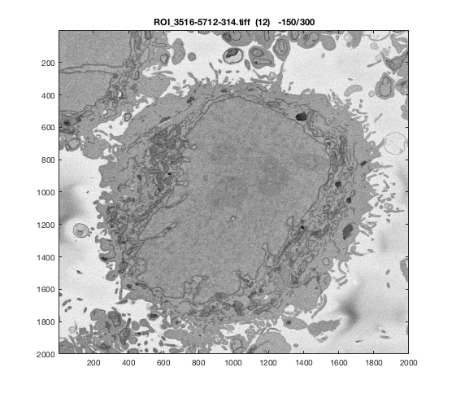
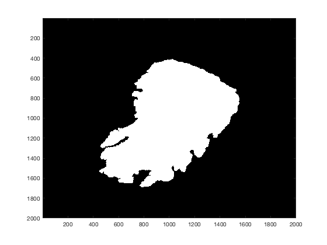
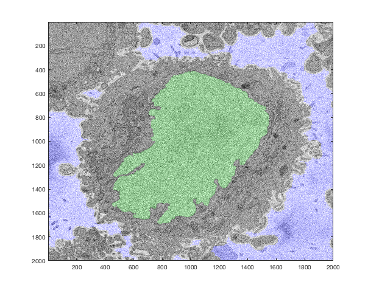
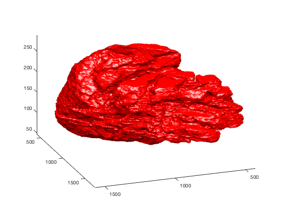

::: {.content}
Contents
--------

<div>

-   [Process a whole stack of images](#1)
-   [Central Slice segmentation and display](#4)
-   [Multiple slices](#10)
-   [Interpolate between slices](#11)
-   [Display of the 3D segmentation](#12)

</div>
<a name="1"/>
Process a whole stack of images 
-------------------------------
</a>
This is a more detailed description of how to process a whole stack of
images that contain one HeLa cell, that is one Region of Interest (ROI)
consisting of approximately 300 slices each with dimensions 2,000 x
2,000 pixels. These can be saved as single slices inside a folder, or as
a multi-slice tiff. Let\'s assume that you have several multi-slice
tiffs. First, read all the files existing in that folder

``` {.codeinput}
dir0                    = dir('*.tiff');
```

It is practical to save this in a directory as later on you can select
the stack you want to process by choosing one of the files saved in the
directory, e.g.

``` {.codeinput}
currentSet              = 12;
currentName             = dir0(currentSet).name;
disp(currentName)
```

``` {.codeoutput}
ROI_3516-5712-314.tiff
```

Once this set has been selected, we can read the information of the file
to know how many slices are saved in this file:

``` {.codeinput}
currentSetInfo          = imfinfo(dir0(currentSet).name);
numSlices               = size(currentSetInfo,1);
```

<a name="4"/>
Central Slice segmentation and display {#4}
--------------------------------------
</a>

Let\'s display the central slice of the stack:

``` {.codeinput}
centralSlice            = round(numSlices/2);
currentImage            = imread(dir0(currentSet).name,centralSlice);

filtG                   = fspecial('gaussian',5,3);

figure(1)
imagesc(imfilter(currentImage,filtG))
title(strcat(currentName,'  (',num2str(currentSet),')    ',...
    '   -  ',num2str(centralSlice),'/',num2str(numSlices)),'interpreter','none')
colormap gray
```



Notice that we filtered the image with a Gaussian Low Pass filter for
display purposes as the original images are grainy. Notice also how we
displayed the name of the file, with the number of the set and the
current slice.

We can now segment the nucleus and the background of the current image.
We can do this with the following lines

``` {.codeinput}
Hela_nuclei(:,:,centralSlice)       = segmentNucleiHelaEM(currentImage);
Hela_background(:,:,centralSlice)   = segmentBackgroundHelaEM(currentImage);

figure(2)
imagesc(Hela_nuclei(:,:,centralSlice));
colormap gray
```



Notice that we stored the result on a 3D matrix, with the level given by
the number of the central slice. This is done so that we can later on
save all the slices and create a 3D volume.

The segmentation on its own is not as revealing as when it is combined
with the original data. For that we can overlay on the original image,
using 3 levels for the RGB components:

``` {.codeinput}
CombinedResults (:,:,1) = currentImage;
CombinedResults (:,:,2) = currentImage+ 51*uint8(Hela_nuclei(:,:,centralSlice));
CombinedResults (:,:,3) = currentImage+ 75*uint8(Hela_background(:,:,centralSlice));
figure(3)
imagesc(CombinedResults);
```



Notice first, the graininess of the original image, and also that, as
the original image was a uint8, we had to convert the results prior to
combining them.

<a name="10"/>
Multiple slices {#10}
---------------
</a>
Once the central slice has been segmented, we can use that result as an
input argument to the function and do this iteratively for all the
slices of the set. We will go up first, and then down. For curiosity,
the time it takes to process all the slices will be calculated with
tic-toc

``` {.codeinput}
tic
for currentSlice=centralSlice+1:289
    % Iterate from the central slice UP, display the current position
    disp(currentSlice)
    % Read slice and convert to a double
    currentImage        = imread(dir0(currentSet).name,currentSlice);
    Hela                = double(currentImage(:,:,1));
    % Perform segmentation and save in the 3D Matrix
    Hela_background(:,:,currentSlice) = segmentBackgroundHelaEM(Hela);
    Hela_nuclei(:,:,currentSlice) = segmentNucleiHelaEM(Hela,Hela_nuclei(:,:,currentSlice-1));
end
t2=toc;

% Go down using the central slice as a guide
tic
for currentSlice=centralSlice:-1:47
    % Iterate from the central slice DOWN, display the current position
    disp(currentSlice)
    % Read slice and convert to a double
    currentImage        = imread(dir0(currentSet).name,currentSlice);
    Hela                = double(currentImage(:,:,1));
    % Perform segmentation and save in the 3D Matrix
    Hela_background(:,:,currentSlice)   = segmentBackgroundHelaEM(Hela);
    Hela_nuclei(:,:,currentSlice)       = segmentNucleiHelaEM(Hela,Hela_nuclei(:,:,currentSlice+1));
end
t3=toc;

disp(strcat('Total time: ',num2str(t2+t3)))
disp(strcat('Time per slice: ',num2str((t2+t3)/(289-47))))
```

``` {.codeoutput}
   151

   152

  ...
  
   288

   289

   150

   149

  ...

    48

    47

Total time:1289.4234
Time per slice:5.3282
```

<a name="11"/>
Interpolate between slices {#11}
--------------------------
</a>
A simple post-processing step is to interpolate between slices/

``` {.codeinput}
% Duplicate results
Hela_nuclei2            = Hela_nuclei;
Hela_nuclei2(1,1,290)   = 0;
% interpolation between slices
Hela_nuclei3(:,:,2:289) =   Hela_nuclei2(:,:,1:288)+...
                            Hela_nuclei2(:,:,2:289)+...
                            Hela_nuclei2(:,:,3:290);

Hela_nuclei3 = round(Hela_nuclei3);
```

<a name="12"/>
Display of the 3D segmentation
------------------------------
</a>
Finally, we would like to visualise the results, there are several ways
to do this, one is to create a video or animated GIF changing the
slices, which will be described in a separate section. Here we will
display the 3D cell as a rendered surface. For this, we need to first
obtain the dimensions of the cell

``` {.codeinput}
[rows,cols,levs]        = size(Hela_nuclei);
```

We could create the surface directly with this, but as the volume is
rather large, the number of faces of the surface would be rather high,
it would be slow and may crash in a computer with low memory. This it is
better to generate the reference framework to create a isosurface with
fewer faces

``` {.codeinput}
[x2d,y2d]               = meshgrid(1:cols,1:rows);
z2d                     = ones(rows,cols);
x3d                     = repmat(x2d,[1 1 levs]);
y3d                     = repmat(y2d,[1 1 levs]);
z3d(rows,cols,levs)     = 0;
for counterSlice=1:levs
    z3d(:,:,counterSlice) = counterSlice*z2d;
end
```

We can now generate the isosurface of the cell, with a certain step;
using fstep =1 would be the same as the whole surface. With 8, the
results are still visually good and hard to distinguish with smaller
steps.

``` {.codeinput}
maxSlice            = 289;
minSlice            = 1;
fstep               = 8;
surf_Hela2          = isosurface(x3d(1:fstep:end,1:fstep:end,minSlice:maxSlice),...
                                 y3d(1:fstep:end,1:fstep:end,minSlice:maxSlice),...
                                 z3d(1:fstep:end,1:fstep:end,minSlice:maxSlice),...
                        Hela_nuclei3(1:fstep:end,1:fstep:end,minSlice:maxSlice),1.5);
```

Finally, let\'s display the surface

``` {.codeinput}
figure(4)
h2 =  patch(surf_Hela2);
view(160,30)
lighting phong
camlight left
camlight right
set(h2,'facecolor','red')
set(h2,'edgecolor','none')
axis tight
```



\
[Published with MATLAB®
R2017a](http://www.mathworks.com/products/matlab/)\
:::
