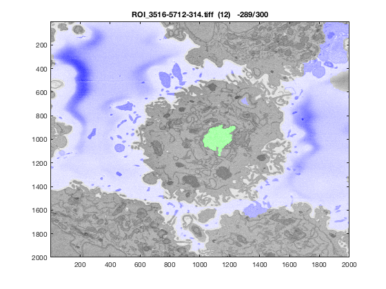

::: {.content}

Contents
--------

<div>

-   [Animated display of results of the 3D stack segmentation](#1)
-   [Loop over all slices](#4)
-   [Save as an MP4 Video](#5)
-   [Save as an animated GIF](#6)

</div>

<a name="1"/>
</a>

Animated display of results of the 3D stack segmentation 
--------------------------------------------------------

There are many ways to display the results of the segmentation of a 3D
stack of images. Previously we have illustrated this with a 3D surface
(Segment3DStack). An alternative to a volume rendering is to generate an
animation in which all the slices are shown consecutively. Whilst this
requires animations to view all the slices, the results can be more
revealing and a video can be scrolled through all the frames, thus it
may be more interesting.

The basic concept of the animations is that every frame of a video has
to be generated and captured. Then it will be saved as a movie (avi,
mp4, etc.) or an animated GIF. For this example, we assume that the
results have been previously obtained and stored in the variables
Hela\_nuclei3 and Hela\_background. However, the current slices were not
stored, so we will need to read them again to create the composite
results.

The frames will be stored in this variable, we begin by clearing it and
grabbing the figure in which the data will be displayed. Notice that it
is important to grab the handle of the figure as this will be passed as
an argument later on.

``` {.codeinput}
clear FramesHela
figure(1)
clf
h0=gcf;
```


<a name="4"/>
</a>

Loop over all slices 
--------------------

Once we have everything ready, we can iterate over all slices, combine
the image with the results and display.

``` {.codeinput}
for currentSlice=47:289
    % Display the current slice
    disp(currentSlice)
    % Read the image of the stack
    currentImage            = imread(dir0(currentSet).name,currentSlice);
    Hela                    = double(currentImage(:,:,1));
    % For visualisation purposes apply a low pass filter
    Hela_LPF                = imfilter(Hela,fspecial('Gaussian',5,2));
    % As this is a double, we will normalise to have values [0:1]
    Hela_LPF                = Hela_LPF /max(Hela_LPF(:));
    % Combine the data into the three RGB Channels
    finalResults (:,:,1)    = Hela_LPF;
    finalResults (:,:,2)    = Hela_LPF+ 0.51*(Hela_nuclei3(:,:,currentSlice)>1);
    finalResults (:,:,3)    = Hela_LPF+ 0.75*Hela_background(:,:,currentSlice);
    % It is important to keep all the values between 0 and 1
    finalResults(finalResults>1) = 1;
    % Display
    imagesc(finalResults)
    % Write the title
    title(strcat(dir0(currentSet).name,'  (',num2str(currentSet),')    ',...
        '   -    ',num2str(currentSlice),'/',num2str(numSlices)),'interpreter','none')
    % It is important to tell Matlab to draw the figure now. The pause is for
    % visualisation
    drawnow
    pause(0.01)
    % Grab the frame. Since we did not start from the first slice, the number of the
    % frame has to be shifted.
    FramesHela(currentSlice-47+1) = getframe(h0);
end
```

``` {.codeoutput}
    47

    48

 ...
 
   287

   288

   289
```




<a name="5"/>
</a>

Save as an MP4 Video 
--------------------

The command to generate a vide is VideoWriter, and it allows several
formats: AVI, MP4, MJ2, M4V. In this case we will save as MP4

``` {.codeinput}
v = VideoWriter(strcat(dir0(currentSet).name(1:end-4),'mp4'), 'MPEG-4');
open(v);
writeVideo(v,FramesHela);
close(v);
```

<a name="6"/>
</a>


Save as an animated GIF 
-----------------------

Animated GIFs are useful for websites and they can also be inserted into
presentations like powerpoint. The code requires to grasp the RGB
colours and convert to an index. This is done with rgb2ind in the
following way:

``` {.codeinput}
[imGif,mapGif] = rgb2ind(FramesHela(11).cdata,256,'nodither');
numFrames      = size(FramesHela,2);
```

When all the slices of the video have the same colour it does not matter
which frame is selected, in the previous lines, it was number 11, but if
1 has different colours from 2, then this should be taken into account.

Finally, the GIF is created by iterating over all the frames and writing
it as an image:

``` {.codeinput}
imGif(1,1,1,numFrames) = 0;
for k = 1:numFrames
    imGif(:,:,1,k) = rgb2ind(FramesHela(k).cdata,mapGif,'nodither');
end


imwrite(imGif,mapGif,strcat(dir0(currentSet).name(1:end-4),'gif'),...
            'DelayTime',0,'LoopCount',inf)
```


\
[Published with MATLAB®
R2017a](http://www.mathworks.com/products/matlab/)\
:::
