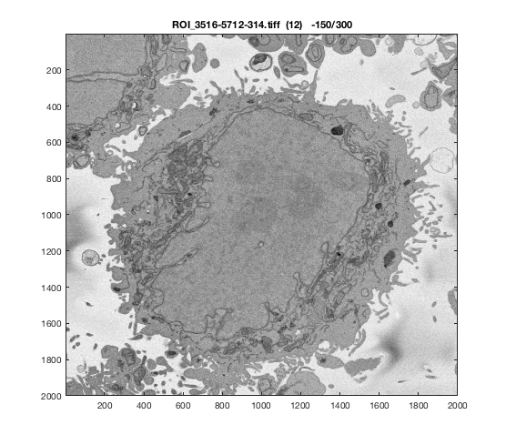
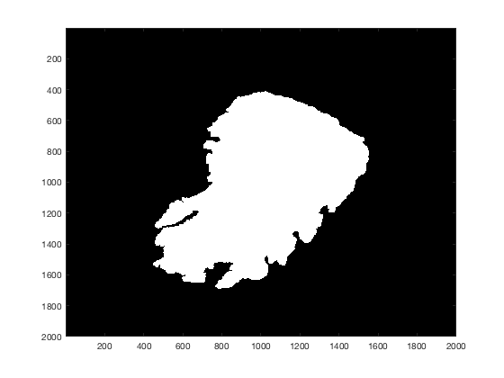

::: {.content}
Contents
--------

<div>

-   [Read ROIs from The Crick](#1)
-   [display 1 slice of 1 data set](#2)

</div>

Read ROIs from The Crick {#1}
------------------------

``` {.codeinput}
dir0                = dir('*.tiff');
```

display 1 slice of 1 data set {#2}
-----------------------------

``` {.codeinput}
currentSet          = 12;
currentName         = dir0(currentSet).name;
currentSetInfo      = imfinfo(dir0(currentSet).name);
numSlices           = size(currentSetInfo,1);

filtG               = gaussF(5,5,1);
```

``` {.codeinput}
%currentSlice=242;
centralSlice        = round(numSlices/2);
currentImage        = imread(dir0(currentSet).name,centralSlice);
figure(1)
imagesc(imfilter(currentImage,filtG))
title(strcat(dir0(currentSet).name,'  (',num2str(currentSet),')    ','   -  ',num2str(centralSlice),'/',num2str(numSlices)),'interpreter','none')
colormap gray
Hela_nuclei(:,:,centralSlice) = segmentNucleiHelaEM(currentImage);
Hela_background(:,:,centralSlice) = segmentBackgroundHelaEM(currentImage);

figure(2)
imagesc( Hela_nuclei(:,:,centralSlice));

colormap gray
```

 

\
[Published with MATLAB®
R2017a](http://www.mathworks.com/products/matlab/)\
:::
