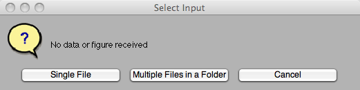
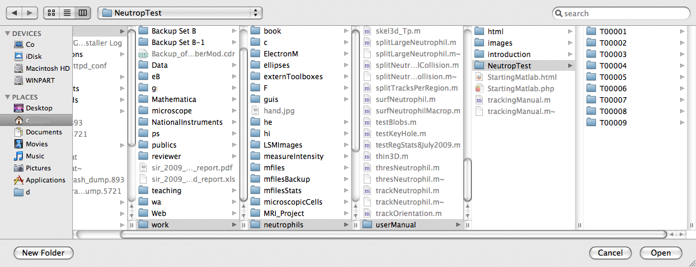

::: {.content}
\
[Previous (Shortcuts Matlab)](shortcuts.php) / [Index](namaste.php) /
[Next (Tracking Neutrophils with Matlab 2)](trackingManual2.php)\

Tracking Neutrophils with Matlab 1
==================================

To track neutrophils, Matlab requires a series of functions and routines
that in some cases call other functions or subfunctions. The data input
should be a directory where you should have a series of directories (one
for each time frame) with tiff files, one for each slice of the data.
This is format how volocity exports the data. So before using Matlab you
need to export the data from volocity.

Contents
--------

-   [Input and Output Folders](#1)
-   [Different Starting Points](#2)
-   [Start the tracking](#5)
-   [Assessing the threshold levels](#9)

Input and Output Folders[]{#1}
------------------------------

It is important to keep names simple, as the tracking will create
several folders related to the original folder, try to avoid spaces and
special characters such as &, \^, %, &, +, etc. It is better use only a
to z, A to Z and numbers. So, if you have a folder with the name
\"images\", the following folders will be created:

-   \% example of the output directories : images\_mat\_Or \<- original
    data in matlab format
-   \% example of the output directories : images\_mat\_Re \<- data
    reduced in size
-   \% example of the output directories : images\_mat\_La \<- labelled
    data
-   \% example of the output directories : images\_mat\_Ha \<- Handles,
    this folder holds the results

The first step will read the data from the TIFF files and transform it
to Matlab, the function \"readNeutrophils\" will then in turn write on a
new root folder a series of directories with the data in matlab format.

Then, to reduce computational complexity by averaging neighbouring
pixels in a uniform pyramid, 2 levels would reduce from 1000x1000 to
250x250 reduceNeutrophils will read the folder and then iteratively
reduce size in each frame and save setNeutrophilHandles determines the
dimensions of the data set and the **\*thresholds**\* used to segment
\"reduceNeutrophil\" will threshold and label the neutrophils. To
increase the accuracy for the segmentation a double thresholding is
performed, small blobs are removed as noise.

All this pre-processing is required to perform the tracking with the
function \"trackNeutrophil\" The final data is stored inside handles,
handles.finalNetwork and handles.nodeNetwork have all the data,
handles.nodeNetwork has the following structure:

\%\[ X Y Z distancetoNext timeFrame ID Parent Child - Volume Label
KeyholeRegion Track FinalLabel BoundingBox(X init Y init Z init X Y Z)
\]\
\

Different Starting Points[]{#2}
-------------------------------

The algorithms can start from different data inputs. That is, you can
start processing the neutrophil data from the images that you will
receive as an output of the acquisition system, but once you have
transformed these images into MATLAB, you do not need to read them
again, you can select as your input any folder, if you want to change
the levels to reduce, then select the folder **images\_mat\_Or**, if you
are happy with the reduced data and you want to change threshold levels,
you can select the folder **images\_mat\_Re**, if you want to track over
the data that has been segmented labelled you can select
**images\_mat\_La**.

\
\

Start the tracking[]{#5}
------------------------

The syntax of the matlab command for the tracking is:

\[handles\]= neutrophilAnalysis(dataInName,numLevelsToReduce);\
\

dataInName : is the name of the folder where the subfolders where the
tiff files are located, you can either pass this name or select it
later. numLevelsToReduce : this controls the reduction of the data, the
default value is 2 that will reduce the images from 1000 x 1000 to 250 x
250. handles keeps the results.

So, to process a folder called \"NeutropTest\" (which contains 9 folders
with tiff files) the easiest way to analyse it is to call the function
with no parameters:

``` {.codeinput}
[handles]= neutrophilAnalysis();
```

This will open a window from which a folder can be selected:

\
\
\

So, for example, to open the folder \"NeutropTest\" you should navigate
to the corresponding folder:

\
\
\

Once you select the folder, the processing will start and as the data is
processed this will appear in the command window:

``` {.codeoutput}
Read tiff images from folders and save as matlab data
Read matlab files from folder, reduce and save in a new folder *_mat_Re
```

The data will now be saved in one file (*T00001.mat, T00002.mat,
T00003.mat*, \... inside the \_mat\_Re folder) for each time frame. The
file contains the 3D structure corresponding to all the images of the
frame. These slices can be of fluorescent or DIC channels, so the
algorithm will now open a new window to determine the structure. The
algorithm will count the number of images (or slices or levels) and then
try to distinguish between DIC and fluorescent. DIC will spread the
intensity in the middle of the range, whilst fluorescent will
concentrate in the low levels (to the left). For instance, a case of 6
levels, 3 green fluorescent and 3 DIC will look like this:

\
\
\

While a case of 40 Green and Re channels would look like this:

\
\
\

The algorithm cannot distinguish between Green and Red Channels, so it
will assume that all fluorescence is green, so you need to correct this
manually in the appropriate window.\
Once you have selected the correct distribution of the levels, the
algorithm will continue:

Assessing the threshold levels[]{#9}
------------------------------------

Immediately after selecting the appropriate levels for the fluorescence
and DIC, the threshold levels are automatically selected. In some cases,
these levels need to be manually verified. This is done with the first
time point of the data.

The algorithms will select the low and high thresholds and a group of
windows will be opened to display:

\(1) The maximum intensity projection (the highest value each
pixel(row,column) can have for each slice down the Z-stack) and the
pixels of this projection that are above the two thresholds. The region
of highest intensity (strongest fluorescence) will be selected to zoom
in.

\(2) A detailed region where the highest intensity is located, and

\(3) A 3D plot of the neutrophils in that region. A red surface will
indicate the low threshold and the blue surface will indicate the high
threshold. This plot is three-dimensional and you can rotate it to find
the best view for the neutrophils in question.

Modifying values
----------------

If you want to change the region to plot (and thus analyse some
interesting neutrophils, two that are very close to each other for
instance), or you want to modify the thresholds, you can do that at this
moment through the command line, where you will be asked if you want to
change something. If you do not want any changes, just press enter.
Otherwise, type \'y\' and enter. Then you will be prompted for the
region to plot (initial Row, final Row, initial Column, final Column)
and the thresholds. If you do not want to change any of them, press
enter, otherwise, type the new value and press enter.

\
{width="650"}\
{width="650"}\
{width="400"}\
\

``` {.codeinput}
Do you want modify plot or threshold levels? Y/N [n]: y
          
```

After typing \'y\' and return you are prompted to change parameters. It
looks like there are two neutrophils very close to each other around the
region of \[210-260\] in the rows and \[510-570\] in the columns (that
is to the right of the zoom region). Thus those parameters are changed:

``` {.codeinput}
Type the new values for the following parameter or press RETURN to leave unchanged
Low threshold =512.6471;800
High threshold =756.2059;1200
Initial row to plot = [210];
Final row to plot = [260];
Initial column to plot = [510];
Final column to plot = [570];
          
```

\
{width="650"}\
{width="650"}\
{width="400"}\
{width="400"}\
\

Now it is time to modify the thresholds. It looks like the neutrophils
are merged into one single cell at both thresholds, therefore, let\'s
try with higher levels, say 880 and 1100 (you may need to go through
several iterations to find the optimal thresholds):

``` {.codeinput}
Type the new values for the following parameter or press RETURN to leave unchanged
Low threshold =512.6471;880
High threshold =756.2059;1100
Initial row to plot = [210];
Final row to plot = [260];
Initial column to plot = [510];
Final column to plot = [570];
          
```

Notice that all other parameters remain the same.

\
{width="500"}

Now that the neutrophils appear separate from each other, the process
can continue. Just press enter at the prompt to keep the same values and
continue with the process:

``` {.codeoutput}
Read reduced matlab data, Threshold, Label and save in a new folder *_mat_La
Split Large Neutrophils and re-save in same folder  *_mat_La
Initial Tracking process
Keep the disappearing cells and re-save in the same folder *_mat_La
Second Tracking process
Split merged cells and re-save in a the same folder _mat_La
Final Tracking process
```

\
[Previous (Shortcuts Matlab)](shortcuts.php) / [Index](namaste.php) /
[Next (Tracking Neutrophils with Matlab 2)](trackingManual2.php)\

\
Published with MATLAB® 7.4\
:::
